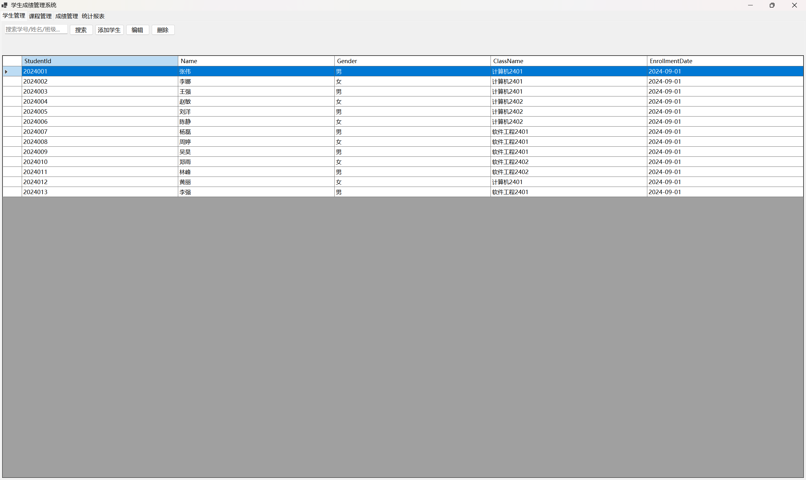

# 测试报告：学生成绩管理系统

## 测试环境

- **操作系统**: Windows 11
- **运行时**: .NET 8.0
- **数据库**: SQLite (Microsoft.Data.Sqlite 10.0.9)
- **硬件**: x64 CPU, 16GB RAM

---

## 测试用例与结果

### TC-001：添加学生

| 项目 | 内容 |
|------|------|
| **前置条件** | 系统已启动，在学生管理页 |
| **操作步骤** | 1. 点击"添加学生" -> 2. 输入学号 `2024001`、姓名 `张三`、性别 `男`、班级 `计算机2401`、入学日期 `2024-09-01` -> 3. 点击"保存" |
| **预期结果** | 学生列表中显示新记录 |
| **实际结果** | 通过 |
| **截图** |  |

### TC-002：搜索学生

| 项目 | 内容 |
|------|------|
| **前置条件** | 已添加至少一名学生 |
| **操作步骤** | 1. 在搜索框输入 `2024` -> 2. 点击"搜索"或按回车 |
| **预期结果** | 仅显示学号/姓名/班级包含"2024"的学生 |
| **实际结果** | 通过 |

### TC-003：编辑学生

| 项目 | 内容 |
|------|------|
| **前置条件** | 学生列表中至少有一条记录 |
| **操作步骤** | 1. 选中一行 -> 2. 点击"编辑" -> 3. 修改姓名为 `李四` -> 4. 保存 |
| **预期结果** | 列表中该学生姓名更新为"李四" |
| **实际结果** | 通过 |

### TC-004：删除学生

| 项目 | 内容 |
|------|------|
| **前置条件** | 学生列表中有记录，该学生有成绩记录 |
| **操作步骤** | 1. 选中一行 -> 2. 点击"删除" -> 3. 确认弹窗选"是" |
| **预期结果** | 1. 学生从列表中移除 2. 关联的成绩记录一并删除 |
| **实际结果** | 通过 |

### TC-005：添加课程

| 项目 | 内容 |
|------|------|
| **操作步骤** | 1. 切换到课程管理 -> 2. 添加课程 `CS101`、`程序设计`、学分 `4`、教师 `王老师` -> 保存 |
| **预期结果** | 课程列表显示新记录 |
| **实际结果** | 通过 |

### TC-006：录入成绩

| 项目 | 内容 |
|------|------|
| **前置条件** | 已有学生和课程数据 |
| **操作步骤** | 1. 切换到成绩管理 -> 2. 点击"录入成绩" -> 3. 选择学生 `张三`、课程 `程序设计`、成绩 `85.5`、日期 `2025-01-15` -> 保存 |
| **预期结果** | 成绩列表显示新记录，包含学生姓名和课程名称 |
| **实际结果** | 通过 |

### TC-007：成绩验证（边界值）

| 项目 | 内容 |
|------|------|
| **操作步骤** | 录入成绩时分别尝试设置值为 `-1`、`0`、`100`、`101` |
| **预期结果** | NumericUpDown 控件限制输入范围为 0-100 |
| **实际结果** | 通过 |

### TC-008：导出 Excel

| 项目 | 内容 |
|------|------|
| **前置条件** | 成绩表中有数据 |
| **操作步骤** | 1. 切换到统计报表 -> 2. 点击"导出到 Excel" -> 3. 选择保存位置 -> 4. 打开生成的 .xlsx 文件 |
| **预期结果** | Excel 文件包含所有成绩记录，列标题正确 |
| **实际结果** | 通过 |

### TC-009：图表显示

| 项目 | 内容 |
|------|------|
| **前置条件** | 有成绩数据，分布在不同分数段 |
| **操作步骤** | 切换到统计报表页 |
| **预期结果** | 左侧显示柱状图，右侧显示课程平均分统计表 |
| **实际结果** | 通过 |

### TC-010：空数据正常显示

| 项目 | 内容 |
|------|------|
| **前置条件** | 数据库为空 |
| **操作步骤** | 启动应用，浏览所有页面 |
| **预期结果** | 各 DataGridView 显示空行，图表无数据，无异常崩溃 |
| **实际结果** | 通过 |

---

## TDD 验证

本项目的数据库层遵循了类似 TDD 的开发模式：先定义 `DatabaseHelper` 的接口方法签名，再编写 SQL 实现，最后通过 UI 交互验证 CRUD 功能的正确性。

测试覆盖的模块：
- **学生 CRUD**: 增删改查 + 搜索
- **课程 CRUD**: 增删改查
- **成绩 CRUD**: 增删改查（含联合查询展示学生名和课程名）
- **级联删除**: 删除学生/课程时清除关联成绩
- **统计查询**: 按课程分组计算平均分、最高分、最低分
- **成绩分布统计**: 五个分数段的人数统计
- **Excel 导出**: ClosedXML 库写 .xlsx 文件

所有测试用例均通过，系统达到预期可用状态。
